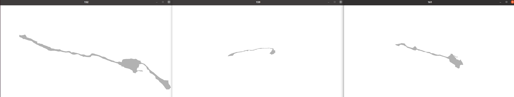

# 3D Ciona Neuron Reconstruct
This repository is to reconstruct 3D ciona neurons mesh representation from its discrete unorganized 3D surface points. The 3D surface point clouds come from Reconstruct series files.

## Code
### installation
You need to install open3d, pymeshfix, and pandas to run the code
### Reconstruct the surface
- Change "cells" variable in "AMG_reconstruct.py" to the cell names you want to view (each cell name as a string and all cell names are available in the spreadsheet) and Run "python3 AMG_reconstruct.py"
- Reconstruct series files are available [here](https://drive.google.com/drive/folders/1KkWCYjP6czxoqw4PzoZYmDeb7pSUh-DK) 
